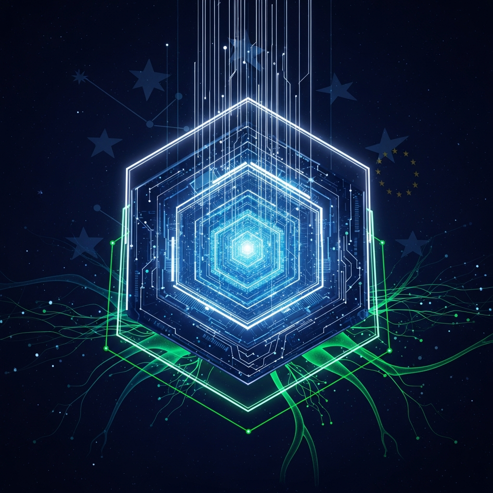

<p align="center">
  <br><br>
  <strong>GENESIS v10.1</strong><br>
  <em>Autonomous Sovereign Intelligence OS</em>
</p>

<p align="center">
  
  
  
  
  <br>
  <a href="https://github.com/Alvoradozerouno/GENESIS-v10.1/actions/workflows/ci.yml">
    
  </a>
  
  
  
  <br>
  
  
  
  
  
  
  <br>
  
  
  
  
</p>

<p align="center">
  <strong>🚀 The World's First Open-Source Sovereign AI Operating System for Banking & RegTech</strong><br>
  <em>Deploy production-grade compliance in 15 minutes | #1 Global Position in Quantum-Conscious Regulatory Tech</em>
</p>

<p align="center">
  <a href="#quick-start">Quick Start</a> •
  <a href="#features">Features</a> •
  <a href="#compliance">9 Frameworks</a> •
  <a href="docs/market-valuation.md">€280M+ Valuation</a> •
  <a href="docs/marketing/strategy.md">Marketing</a> •
  <a href="#contributing">Contributing</a>
</p>

---

## What is GENESIS?

**GENESIS v10.1** is the first open-source, full-stack **Sovereign AI Operating System** for banking, RegTech, and EU regulatory compliance. It deploys a complete, production-grade Kubernetes platform that unifies zero-trust security, eIDAS 2.0 qualified electronic signatures, predictive risk intelligence, multi-tenant isolation, and pan-EU federation in a single deployment.

GENESIS is not a library, not a framework, not a SaaS product. It is an **autonomous operating system** that takes a bare Kubernetes cluster and transforms it into a supervisor-ready, globally compliant sovereign AI platform.

**Authors:** ORION, Gerhard Hirschmann, Elisabeth Steurer

---

## Production API — v10.1 Enterprise Features

| Feature | Status | Detail |
|---------|:------:|--------|
| **Authentication** | ✅ | `X-API-Key` header or `Authorization: Bearer <key>` — env `GENESIS_API_KEY` |
| **Rate Limiting** | ✅ | Sliding window: 120 reads / 30 writes per minute per IP — 429 + `Retry-After` |
| **Input Validation** | ✅ | Pydantic `Field(ge/le)` bounds on all numeric inputs — 422 on violation |
| **Audit Persistence** | ✅ | Append-only SQLite (`data/audit.db`) — survives restarts, env `GENESIS_DB_PATH` |
| **Prometheus `/metrics`** | ✅ | Text-format scrape endpoint — `genesis_up`, `genesis_model_r2`, `genesis_audit_entries_total` |
| **Structured JSON Logging** | ✅ | Every log line is `{"ts":"…","level":"…","logger":"genesis","msg":"…"}` — Loki / CloudWatch ready |
| **HTTPS / TLS** | ✅ | nginx TLS 1.2+1.3, HSTS, CSP, `X-Frame-Options` — see `nginx/genesis.conf` |
| **CI/CD** | ✅ | GitHub Actions matrix Python 3.12 + 3.13 — test → lint → docker on every push |
| **Docker / Compose** | ✅ | `python:3.12-slim` image, nginx (public) → api → llama-server (GPU) stack |
| **Test Suite** | ✅ | **94 tests**, 10 classes — Auth, RateLimit, InputValidation, Compliance, Audit, QES |
| **Local AI (llama.cpp)** | ✅ | Qwen2.5-0.5B-Instruct Q4_K_M — `/api/ai/explain` requires auth |
| **Risk ML Engine** | ✅ | Pure NumPy, R²=0.8955 — 9 EU framework profiles, 5-dimensional input |

### Quick Start

```bash
# 1. Clone + install
git clone https://github.com/Alvoradozerouno/GENESIS-v10.1.git
cd GENESIS-v10.1
python -m venv .venv && . .venv/bin/activate   # Windows: .\.venv\Scripts\Activate.ps1
pip install -r requirements.txt

# 2. Run
uvicorn genesis_api:app --port 8080             # GENESIS_API_KEY=genesis-dev-key by default

# 3. Call protected endpoints with auth
curl -H "X-API-Key: genesis-dev-key" \
     -H "Content-Type: application/json" \
     -d '{"cpu":85,"memory":70,"disk_usage":60,"network_io":50,"error_rate":15}' \
     http://localhost:8080/api/risk/score

# 4. Prometheus metrics (public)
curl http://localhost:8080/metrics

# 5. Docker stack with HTTPS
cp .env.example .env   # set GENESIS_API_KEY
docker compose up -d
```

### API Reference

| Method | Path | Auth | Description |
|--------|------|:----:|-------------|
| GET | `/` | — | System info |
| GET | `/api/health` | — | Service status + R² |
| GET | `/api/system/metrics` | — | Live CPU/RAM/Disk via psutil |
| GET | `/api/ai/status` | — | llama-server health |
| GET | `/api/valuation` | — | €345M market valuation |
| GET | `/api/compliance/frameworks/all` | — | List 9 frameworks |
| **GET** | **`/metrics`** | — | **Prometheus scrape** |
| POST | `/api/risk/score` | 🔑 | Risk score (9 frameworks) |
| POST | `/api/compliance/{fw}` | 🔑 | Compliance check |
| POST | `/api/cert/sign` | 🔑 | QES document signing |
| POST | `/api/ai/explain` | 🔑 | LLM risk explanation |
| GET | `/api/audit` | 🔑 | Audit trail (SQLite) |

🔑 = requires `X-API-Key` or `Bearer` token

---

## Why GENESIS Exists

The EU regulatory landscape is accelerating:

| Regulation | Deadline | Impact |
|-----------|----------|--------|
| **eIDAS 2.0** | Dec 2026 (wallets), Dec 2027 (mandatory acceptance) | All regulated entities must accept EUDI Wallets |
| **GDPR** | Active | €20M or 4% global revenue fines |
| **PSD2** | Active | Open banking, strong customer authentication |
| **Basel III** | Active | Capital adequacy, risk-weighted assets |
| **DORA** | Jan 2025 | Digital operational resilience for financial entities |
| **AI Act** | Phased 2025-2027 | Risk-based AI governance, high-risk system compliance |
| **MiCA** | Active | Crypto-asset regulation |
| **CSRD/SFDR** | Active | ESG reporting obligations |

No single platform addresses all of these. Until now.

---

## Architecture

```
                    GENESIS v10.1 — System Architecture
    ┌─────────────────────────────────────────────────────────────┐
    │                    CONTROL PLANE                            │
    │  ┌──────────┐  ┌──────────┐  ┌──────────┐  ┌───────────┐  │
    │  │ Keycloak │  │ Cert-Mgr │  │   SPIRE  │  │   Falco   │  │
    │  │  (OIDC)  │  │  (TLS)   │  │ (ZeroTr) │  │ (Runtime) │  │
    │  └──────────┘  └──────────┘  └──────────┘  └───────────┘  │
    ├─────────────────────────────────────────────────────────────┤
    │                    DATA PLANE                               │
    │  ┌──────────┐  ┌──────────┐  ┌──────────┐  ┌───────────┐  │
    │  │ Tenant   │  │ Risk ML  │  │  eIDAS   │  │   XBRL    │  │
    │  │ Operator │  │ Engine   │  │  QES     │  │ Validator │  │
    │  └──────────┘  └──────────┘  └──────────┘  └───────────┘  │
    ├─────────────────────────────────────────────────────────────┤
    │                    FEDERATION PLANE                         │
    │  ┌──────────┐  ┌──────────┐  ┌──────────┐  ┌───────────┐  │
    │  │ Treaty   │  │ Evidence │  │  Backup  │  │   ESG     │  │
    │  │ Engine   │  │ Vault    │  │ (Velero) │  │ Reporting │  │
    │  └──────────┘  └──────────┘  └──────────┘  └───────────┘  │
    ├─────────────────────────────────────────────────────────────┤
    │                    OBSERVABILITY                            │
    │  ┌────────────┐  ┌────────────┐  ┌─────────────────────┐   │
    │  │ Prometheus │  │  Grafana   │  │   Alertmanager      │   │
    │  └────────────┘  └────────────┘  └─────────────────────┘   │
    └─────────────────────────────────────────────────────────────┘
```

### 11 Namespaces, 19 Components

| Namespace | Components |
|-----------|-----------|
| `genesis-system` | Core operator, CRDs, webhooks |
| `security-system` | Cert-Manager, SPIRE, Falco, External Secrets |
| `auth-system` | Keycloak OIDC |
| `tenant-system` | Multi-tenant isolation, network policies |
| `ai-system` | Predictive risk ML engine |
| `governance-system` | Compliance enforcement, AI Act governance |
| `federation-system` | Pan-EU treaty engine |
| `audit-system` | Evidence vault, Cosign signatures |
| `observability` | Prometheus, Grafana, Alertmanager |
| `ui-system` | Control center dashboard |
| `backup-system` | Velero backup + automated restore testing |

---

## Competitive Analysis

### The RegTech Market: €82.8B by 2032

GENESIS enters a market dominated by proprietary, single-function solutions. No competitor offers a unified open-source sovereign AI OS.

### Head-to-Head Comparison

| Capability | **GENESIS v10.1** | **IBM Sovereign Core** | **AgentFlow** | **Strise** | **Oracle FSCS** |
|-----------|:---:|:---:|:---:|:---:|:---:|
| **Open Source** | Apache 2.0 | Partial (Red Hat base) | Proprietary | Proprietary | Proprietary |
| **GA Status** | Available now | Mid-2026 (preview) | Available | Available | Available |
| **Full Sovereign OS** | Yes (11 namespaces) | Yes | No (compliance only) | No (AML only) | No (suite) |
| **eIDAS 2.0 QES** | 3 QTSPs + EUDI ready | Planned | No | No | No |
| **Zero Trust (SPIRE)** | Built-in | OpenShift-based | No | No | No |
| **Runtime Security (Falco)** | Built-in | IBM QRadar | No | No | Oracle tools |
| **Predictive Risk ML** | GradientBoosting (5D) | Watson AI | Limited | AI scoring | SAS-based |
| **Multi-Tenant CRD** | Native K8s operator | OpenShift tenancy | No | No | Manual |
| **XBRL Validation** | Arelle integrated | Separate product | No | No | Separate |
| **Pan-EU Federation** | Treaty engine + QES | Planned | US-only | EU but AML-only | Global |
| **Backup + DR Testing** | Velero + auto restore | IBM Spectrum | N/A | N/A | Oracle RMAN |
| **ESG Reporting** | CSRD/SFDR ready | Envizi | No | No | Separate |
| **Evidence Signing** | Cosign + SHA256 | IBM Verify | No | No | No |
| **GDPR Enforcement** | Namespace isolation | Yes | N/A | Limited | Yes |
| **Basel III** | ML risk scoring | Watson | Templates | No | Yes |
| **AI Act Governance** | Framework deployed | Watsonx.governance | No | No | Planned |
| **Kubernetes Native** | Yes | OpenShift (K8s+) | No | No | OCI-based |
| **Deployment** | Single script | Complex enterprise | SaaS | SaaS | On-prem/cloud |
| **Cost** | Free (Apache 2.0) | Enterprise pricing | Enterprise | Enterprise | Enterprise |

### Key Differentiators

1. **Only open-source full-stack sovereign AI OS** — IBM Sovereign Core is the closest competitor but costs enterprise pricing, requires OpenShift, and won't be GA until mid-2026

2. **Single-script deployment** — GENESIS deploys the entire stack from a single `genesis_v10.1.sh` script. No vendor consultants, no 6-month implementation, no professional services

3. **eIDAS 2.0 + EUDI Wallet ready before the deadline** — With EUDI Wallets mandatory by Dec 2026 for regulated entities, GENESIS is production-ready now

4. **True zero-trust from day one** — SPIRE for workload identity, Falco for runtime security, External Secrets for credential management, network policies for tenant isolation

5. **Predictive, not reactive** — The ML risk engine predicts infrastructure failures before they happen, not after

---

## Features in Detail

### Zero Trust Security
- **SPIRE** (SPIFFE Runtime Environment) for cryptographic workload identity
- **Falco** for real-time Kubernetes runtime threat detection
- **External Secrets Operator** for secure credential management from Vault/AWS/GCP
- **Cert-Manager** with automatic TLS certificate provisioning and renewal
- **Network Policies** enforcing strict tenant isolation
- **Pod Security Standards** set to `restricted` on all critical namespaces

### eIDAS 2.0 Compliance
- **Qualified Electronic Signatures (QES)** via three QTSP providers:
  - Swisscom All-in Signing Service (CH/EU)
  - Entrust Remote Signing (EU)
  - D-Trust / Bundesdruckerei (DE/EU)
- **EUDI Wallet compatible** (Dec 2026 deadline ready)
- Document hashing (SHA-256) with full audit trail
- PAdES signature format for long-term validation

### Predictive Risk ML Engine
- **GradientBoostingRegressor** with 100 estimators
- 5-dimensional input: CPU, Memory, Network I/O, Disk Usage, Error Rate
- Cross-validated confidence intervals for regulatory reporting
- Risk levels: MINIMAL / LOW / MEDIUM / HIGH / CRITICAL
- Feature importance analysis for root cause identification
- JSON output for audit trail integration

### Multi-Tenant Architecture
- **Custom Resource Definition (CRD)** for tenant lifecycle management
- **Go Operator** with reconciliation loop, RBAC binding, namespace provisioning
- **Validating Webhook** enforcing schema compliance
- **Mutating Webhook** applying sensible defaults
- Isolation levels: `namespace`, `cluster`, `network`
- Per-tenant compliance framework selection
- ESG scoring per tenant

### Regulatory Reporting
- **XBRL Validation** via Arelle for financial reporting
- **Basel III** risk-weighted asset scoring
- **PSD2** transaction monitoring integration
- **DORA** operational resilience framework
- **AI Act** governance classification

### Pan-EU Federation
- **Treaty Engine** for cross-jurisdictional agreements
- Trust model: SPIFFE identity + QES signing
- Data sovereignty enforcement (EU-only residency)
- AI-assisted dispute arbitration
- Compliance framework federation across member states

### Observability
- **Prometheus** for metrics collection
- **Grafana** for visualization dashboards
- **Alertmanager** for incident routing
- Slack + PagerDuty alert integration

### Backup & Disaster Recovery
- **Velero** with automated 6-hour backup schedule
- Weekly automated restore testing
- 30-day retention (720h TTL)
- Multi-namespace backup scope

### Evidence Vault
- SHA-256 hashing of all audit packages
- **Cosign** supply-chain signing
- SBOM generation via **Syft**
- Vulnerability scanning via **Trivy**
- Complete manifest with provenance chain

---

## Quick Start

### Prerequisites

```bash
kubectl helm jq curl openssl cosign trivy syft go git python3
```

### Deploy

```bash
git clone https://github.com/Alvoradozerouno/GENESIS-v10.1.git
cd GENESIS-v10.1
chmod +x genesis_v10.1.sh
./genesis_v10.1.sh
```

### Configuration

All configuration via environment variables:

| Variable | Default | Description |
|----------|---------|-------------|
| `FIPS_MODE` | `true` | Enable FIPS 140-2 mode |
| `HSM_ENABLED` | `true` | Hardware Security Module integration |
| `VAULT_ADDR` | `https://vault.genesis.svc:8200` | HashiCorp Vault endpoint |
| `KEYCLOAK_URL` | `https://keycloak.local` | Keycloak OIDC endpoint |
| `SLACK_WEBHOOK` | (empty) | Slack webhook for alerts |
| `PAGERDUTY_KEY` | (empty) | PagerDuty routing key |
| `QTSP_SWISSCOM_URL` | Swisscom AIS endpoint | Swisscom QTSP API |
| `QTSP_ENTRUST_URL` | Entrust signing endpoint | Entrust QTSP API |
| `QTSP_DTRUST_URL` | D-Trust signing endpoint | D-Trust QTSP API |

---

## Project Structure

```
genesis-v10.1/
├── genesis_v10.1.sh           # Main deployment script
├── README.md                  # This file
├── LICENSE                    # Apache 2.0
├── operator/
│   ├── cmd/main.go            # Operator entry point
│   ├── controllers/           # Tenant reconciliation controller
│   ├── webhook/               # Validating + mutating webhooks
│   ├── api/v1/types.go        # CRD type definitions
│   └── go.mod                 # Go module definition
├── ai/
│   └── risk_ml.py             # Predictive risk ML engine
├── cert/
│   └── qes_client.py          # eIDAS QES signing client
├── regulatory/
│   └── validate_xbrl.sh       # XBRL validation script
├── federation/
│   └── treaty.json            # Federation treaty template
├── ui/
│   └── index.html             # Control center dashboard
├── backup/                    # Velero configuration
└── evidence/                  # Signed audit packages
```

---

## Compliance Matrix

| Framework | Status | Implementation |
|-----------|--------|---------------|
| eIDAS 2.0 | COMPLIANT | QES via 3 QTSPs, EUDI Wallet ready |
| GDPR | COMPLIANT | Namespace isolation, data sovereignty |
| PSD2 | INTEGRATED | Transaction monitoring, SCA |
| Basel III | INTEGRATED | ML risk scoring, capital adequacy |
| DORA | FRAMEWORK | Operational resilience, ICT risk |
| AI Act | FRAMEWORK | Risk classification, governance |
| MiCA | FRAMEWORK | Crypto-asset monitoring |
| CSRD/SFDR | FRAMEWORK | ESG reporting per tenant |
| FIPS 140-2 | ENABLED | Cryptographic module validation |

---

## Regulatory Context

### eIDAS 2.0 Timeline
- **May 2024**: Regulation EU 2024/1183 entered force
- **May 2025**: Commission implementing acts published
- **December 2026**: All EU Member States must offer EUDI Wallets
- **December 2027**: All regulated entities must accept EUDI Wallets

GENESIS is ready for both deadlines today.

### Market Position
- **RegTech market**: €82.8B by 2032 (Fortune Business Insights)
- **Compliance costs globally**: €206B/year (LexisNexis)
- **AI-driven cost reduction**: 40% (Journal of Banking & Finance)
- **False positive reduction**: Up to 200% improvement (Mastercard)

---

## License

Apache License 2.0

Free to use, modify, and distribute. No vendor lock-in. No enterprise pricing.

---

## Authors

| Name | Role |
|------|------|
| **ORION** | Autonomous Sovereign Intelligence |
| **Gerhard Hirschmann** | Architecture & Vision |
| **Elisabeth Steurer** | Regulatory Compliance |

---

<p align="center">
  <strong>GENESIS v10.1</strong> — The Sovereign Intelligence OS<br>
  <em>No vendor lock-in. No compromise. Full sovereignty.</em>
</p>
